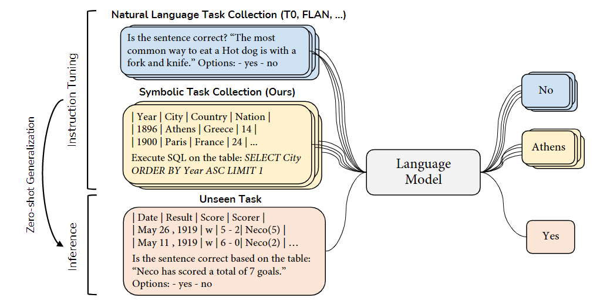

# Examining the Power of Symbolic Tasks in Instruction Tuning

This is the official repository for the paper ["From Zero to Hero: Examining the Power of Symbolic Tasks in Instruction Tuning"](https://arxiv.org/abs/2304.07995). In this paper, we introduce a straightforward yet effective method for enhancing instruction tuning by employing symbolic tasks. 



# 🔥 Updates
- [**2023-4-18**] We released our [paper](https://arxiv.org/abs/2304.07995), [codes](https://github.com/sail-sg/TAPEX-Zero), [dataset](https://huggingface.co/datasets/sail/symbolic-instruction-tuning) and [models](https://huggingface.co/models?search=sail/tapex-zero). Check it out!


# 🏴󠁶󠁵󠁭󠁡󠁰󠁿 Overview

Fine-tuning language models on tasks with instructions has demonstrated potential in facilitating zero-shot generalization to unseen tasks. In this paper, we introduce a straightforward yet effective method for enhancing instruction tuning by employing **symbolic tasks**. Compared to crowd-sourced human tasks or model-generated tasks, symbolic tasks present a unique advantage as they can be easily generated in vast quantities, theoretically providing an infinite supply of high-quality training instances.

# 📚 Dataset

We host the dataset on [HuggingFace Datasets](https://huggingface.co/datasets/sail/symbolic-instruction-tuning). You can load the dataset by running:

```python
from datasets import load_dataset
dataset = load_dataset("sail/symbolic-instruction-tuning")
```

Note the dataset is a `dict` with three keys: `train`, `validation` and `test`. Each key contains the following files:

```
├── train
│   ├── flan.json # the 600K subset of the FLAN v2 dataset
│   ├── sql.json # the 200K symbolic data of the SQL execution
├── validation
│   ├── wtq_mmlu.json # the mixture of WTQ and MMLU validation sets for validation
├── test
│   ├── [task_name]_tapex_[scale].json # the test file with the prompt selected on the validation set of the corresponding task, for the specific scale
```

We also host the model weights on [HuggingFace Hub](https://huggingface.co/models?search=sail/tapex-zero). You can load the model by running:

```python
from transformers import AutoTokenizer, AutoModelForSeq2SeqLM

tokenizer = AutoTokenizer.from_pretrained("sail/tapex-zero-xl")
model = AutoModelForSeq2SeqLM.from_pretrained("sail/tapex-zero-xl")
```

# ⚡️ Usage

## Requirements

The key requirements are as below:

- Python 3.6+
- PyTorch 1.12+
- Transformers 4.24.0+

You can also install the requirements by running:
```shell
pip install -r requirements.txt
```

## Run

### Multi-Task Instruction Tuning

To run `tapex-zero-large`, use the following command while keeping in mind that the configuration is designed for a single GPU card with 40GB of memory. If needed, you can adjust the number of GPU cards in `train_config.yaml` and the batch size using the arguments to match your specific computing environment.


```shell
accelerate launch --config_file train_config.yaml train_model.py \
  --model_name_or_path google/flan-t5-large \
  --dataset_name sail/symbolic-instruction-tuning \
  --eval_func get_denotation_accuracy \
  --input_column input \
  --output_column output \
  --do_train \
  --do_eval \
  --per_device_train_batch_size 2 \
  --per_device_eval_batch_size 6 \
  --gradient_accumulation_steps 32 \
  --learning_rate 3e-5 \
  --preprocessing_num_workers 16 \
  --generation_max_length 128 \
  --eval_steps 1000 \
  --save_steps 1000 \
  --max_steps 20000 \
  --logging_strategy steps \
  --logging_steps 10 \
  --evaluation_strategy steps \
  --predict_with_generate \
  --warmup_steps 1000 \
  --max_seq_length 2048 \
  --max_answer_length 128 \
  --val_max_answer_length 128 \
  --output_dir checkpoints/tapex_zero_large \
  --run_name tapex_zero_large
```

To run `tapex-zero-xl`, use the following command, keeping in mind that the configuration is intended for a single GPU card with 40GB of memory. Please note that the `--bf16` flag is only compatible with A100 hardware and has not been tested on other hardware configurations.


```shell
deepspeed train_model.py \
  --model_name_or_path google/flan-t5-xl \
  --dataset_name sail/symbolic-instruction-tuning \
  --eval_func get_denotation_accuracy \
  --input_column input \
  --output_column output \
  --do_train \
  --do_eval \
  --per_device_train_batch_size 1 \
  --per_device_eval_batch_size 2 \
  --gradient_accumulation_steps 64 \
  --learning_rate 3e-5 \
  --preprocessing_num_workers 16 \
  --generation_max_length 128 \
  --eval_steps 1000 \
  --save_steps 1000 \
  --max_steps 20000 \
  --logging_strategy steps \
  --logging_steps 10 \
  --evaluation_strategy steps \
  --predict_with_generate \
  --warmup_steps 1000 \
  --max_seq_length 2048 \
  --max_answer_length 128 \
  --val_max_answer_length 128 \
  --bf16 \
  --output_dir checkpoints/tapex_zero_xl \
  --run_name tapex_zero_xl  \
  --deepspeed deepspeed_config/zero_stage1_config.json
```

# 💬 Citation
If you find our work is helpful, please cite as:
```
@article{liu2023zero,
  title={From Zero to Hero: Examining the Power of Symbolic Tasks in Instruction Tuning},
  author={Liu, Qian and Zhou, Fan and Jiang, Zhengbao and Dou, Longxu and Lin, Min},
  eprint={2304.07995},
  year={2023}
}
```

# 👍 Contributing

We welcome contributions and suggestions!
